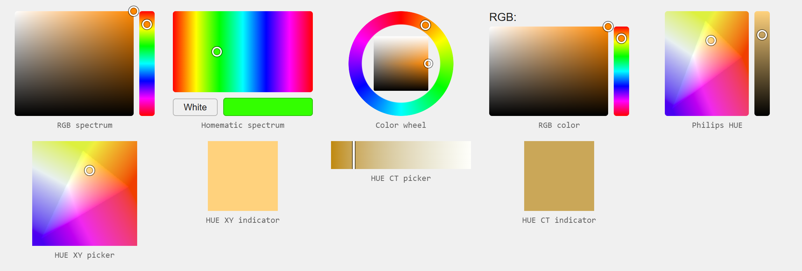
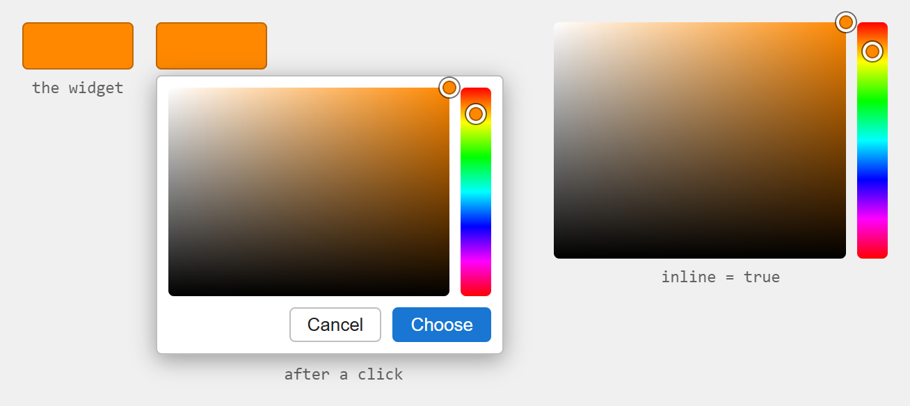
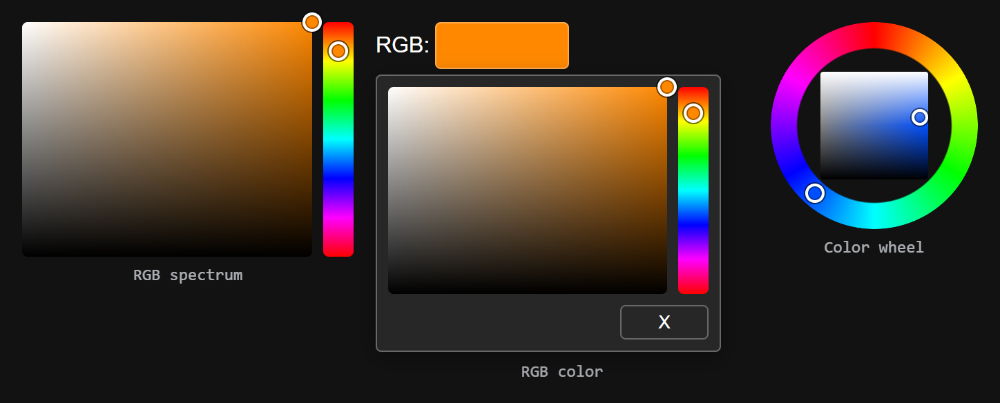
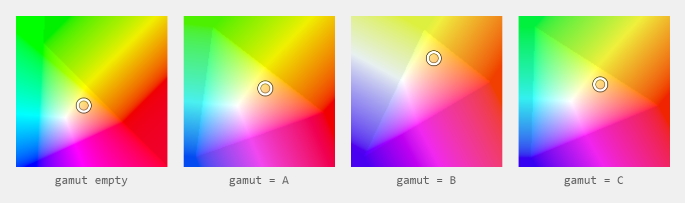
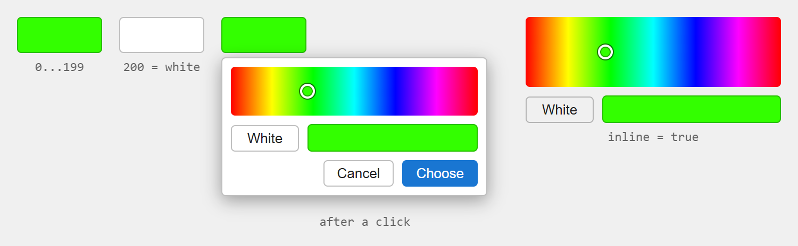
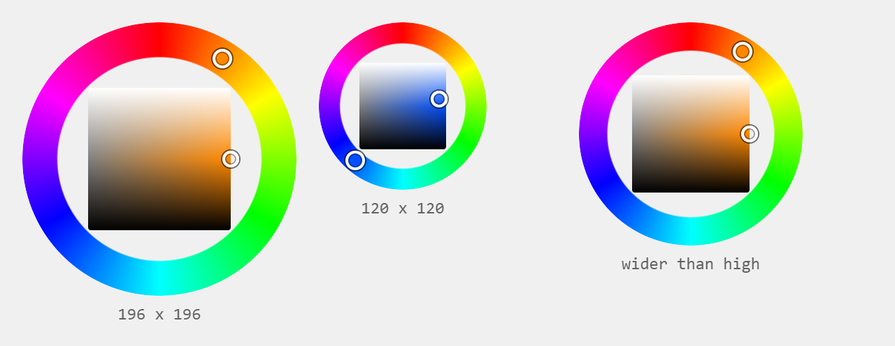
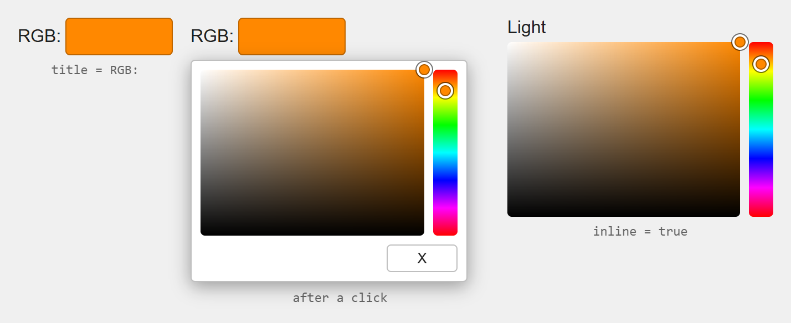
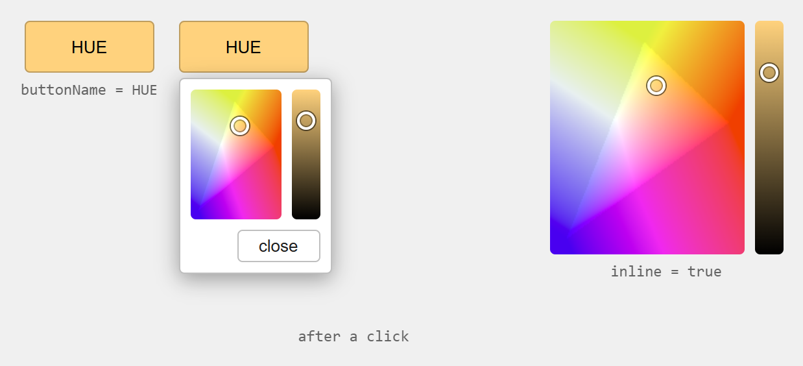
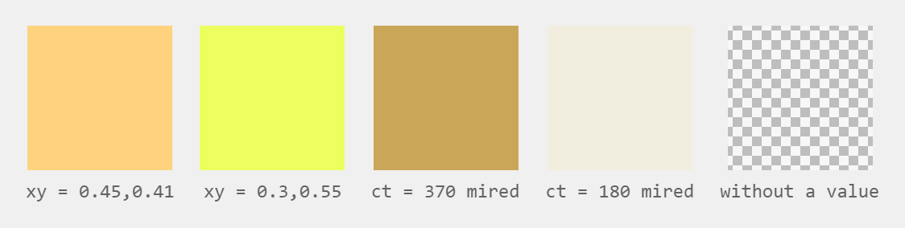
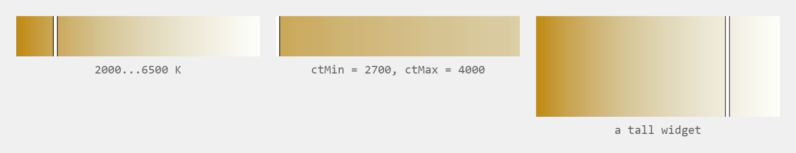

# Farbauswahl-Widgets für vis-2

Neun Widgets, um eine Farbe zu setzen und anzuzeigen: drei allgemeine Farbauswahlen, eine für Homematic-Lampen
und fünf für Philips-HUE-Lampen. Diese Seite beschreibt die **vis-2**-Version. vis (vis-1) hat dieselben Widgets
mit denselben Einstellungen, dort von jQuery-Bibliotheken gezeichnet statt von React.



**Inhalt**

- [Allgemein](#allgemein)
    - [Voraussetzungen und Migration](#voraussetzungen-und-migration)
    - [Woher die Farbe kommt und wohin sie geht](#woher-die-farbe-kommt-und-wohin-sie-geht)
    - [Faktor und Nachkommastellen](#faktor-und-nachkommastellen)
    - [Die Auswahl im Widget](#die-auswahl-im-widget)
    - [Wann die Farbe geschrieben wird](#wann-die-farbe-geschrieben-wird)
    - [Dunkles Theme](#dunkles-theme)
    - [Philips HUE: ein Befehl pro Änderung](#philips-hue-ein-befehl-pro-änderung)
    - [Gamut einer Lampe](#gamut-einer-lampe)
- [RGB-Spektrum - `tplRGBSpectrum`](#rgb-spektrum---tplrgbspectrum)
- [Homematic-Spektrum - `tplSpectrumHomematic`](#homematic-spektrum---tplspectrumhomematic)
- [Farbkreis - `tplRGBFarbtastic`](#farbkreis---tplrgbfarbtastic)
- [RGB-Farbe - `tplJscolor`](#rgb-farbe---tpljscolor)
- [Philips HUE - `tplHUEjscolor`](#philips-hue---tplhuejscolor)
- [HUE-XY-Auswahl - `tplHUEPickerXY`](#hue-xy-auswahl---tplhuepickerxy)
- [HUE-XY-Anzeige - `tplHUEIndicatorXY`](#hue-xy-anzeige---tplhueindicatorxy)
- [HUE-CT-Auswahl - `tplHUEPickerCT`](#hue-ct-auswahl---tplhuepickerct)
- [HUE-CT-Anzeige - `tplHUEIndicatorCT`](#hue-ct-anzeige---tplhueindicatorct)
- [Unterschiede zu vis-1](#unterschiede-zu-vis-1)

## Allgemein

### Voraussetzungen und Migration

Die Widgets liegen im Widget-Set **Farbauswahl** des vis-2-Editors. Die hier beschriebenen React-Widgets
benötigen **vis-2 2.12.8** oder neuer; mit einem älteren vis-2 werden die vis-1-Widgets verwendet.

Projekte aus vis-1 laufen unverändert weiter. Beide Versionen benutzen dieselben Widget-IDs (`tplRGBSpectrum`,
`tplJscolor`, `tplHUEjscolor`, …) und dieselben Attributnamen, und vis-2 nimmt automatisch die React-Version.
Alle Einstellungen bleiben erhalten.

In den Tabellen ist **Einstellung** die Beschriftung im vis-2-Editor und **Attribut** der Name, unter dem der
Wert im Projekt gespeichert wird. Der Attributname ist das, was zählt, wenn ein Projekt als JSON bearbeitet oder
eine Einstellung von einem Widget zum anderen kopiert wird.

### Woher die Farbe kommt und wohin sie geht

Die meisten Widgets können mit drei Gruppen von Datenpunkten gleichzeitig verbunden werden. Jede ausgefüllte
Gruppe wird bei einer Änderung **geschrieben**:

| Gruppe | Attribute | Was gespeichert wird |
|---|---|---|
| RGB-String | `rgb-oid` | `#ff8800`. Gelesen werden auch `#rgb`, `#rrggbb`, `rgb(255,136,0)`, `hsl(…)`, `hsv(…)` sowie `white` und `black`. |
| Drei Kanäle | `red-oid`, `green-oid`, `blue-oid` | Drei Zahlen 0…255, beim Schreiben durch den *Faktor* geteilt. Alle drei müssen gesetzt sein. |
| Farbton, Sättigung, Helligkeit | `hue-oid`, `sat-oid`, `bri-oid` | Farbton 0…360 und zwei Werte, deren Bereich vom Widget abhängt, siehe unten. Alle drei müssen gesetzt sein. |

**Angezeigt wird die erste Gruppe, die einen Wert hat**: der RGB-String vor den drei Kanälen und diese vor
Farbton/Sättigung/Helligkeit. Das ist die Reihenfolge, in der die vis-1-Widgets ihre Handler gebunden haben, wo
der letzte bestimmte, was die Auswahl anzeigt.

Die beiden Spektrum-Widgets und der Farbkreis rechnen in **HSL**: Sättigung und Helligkeit liegen zwischen `0`
und `1` und werden beim Schreiben mit dem *Faktor* multipliziert. *RGB-Farbe* und *Philips HUE* rechnen wie
jscolor in **HSV**: Sättigung und Helligkeit liegen zwischen `0` und `100` und werden **geteilt**. Ein Widget
ohne Datenpunkt zeigt ein graues Schachbrettmuster.

### Faktor und Nachkommastellen

| Einstellung | Attribut | Vorgabe | Beschreibung |
|---|---|---|---|
| Faktor | `factor` (bei *Philips HUE* `divisor`) | 1 | Die Datenpunkte werden beim Lesen damit multipliziert und beim Schreiben dadurch geteilt. `255` macht aus Kanälen von 0 bis 1 den Bereich 0…255, `100` aus einer Sättigung von 0…1 Prozent. |
| Nachkommastellen | `decimal` | 0 | Nachkommastellen der geschriebenen Werte. |

### Die Auswahl im Widget



Widgets, die in vis-1 nur ein kleines Farbfeld gezeigt haben, kennen die neue Einstellung **Auswahl im Widget**
(`inline`). Damit *ist* das Widget die Farbauswahl - kein Popup, kein Klick nötig, was auf einem Wandpanel
gewünscht ist. Das Widget sollte dafür groß genug sein: etwa 200 x 150 Pixel für ein Quadrat mit Farbtonleiste.

Ohne diese Einstellung zeigt das Widget das Farbfeld, und ein Klick öffnet die Auswahl darunter. Sie schließt
sich mit einem Klick daneben oder mit der Escape-Taste.

### Wann die Farbe geschrieben wird

*RGB-Spektrum* und *Homematic-Spektrum* schreiben die Farbe wie in vis-1 erst beim Druck auf **Wählen** - so
folgt eine Lampe nicht jeder Zwischenfarbe. Alle anderen Widgets schreiben schon beim Ziehen, höchstens alle
200 ms und danach noch einmal beim Loslassen.

Während des Ziehens zeigt das Widget die eigene Farbe, auch wenn die Datenpunkte langsamer oder leicht anders
antworten; 1,5 Sekunden nach der letzten Änderung folgt es wieder den Datenpunkten.

### Dunkles Theme



Die Auswahl, ihre Schaltflächen und die Texte übernehmen die Farben des vis-2-Themes. Die Farbflächen selbst sind
in beiden Themes natürlich gleich.

### Philips HUE: ein Befehl pro Änderung

Die fünf HUE-Widgets schreiben die Farbe nicht in `xy` oder `ct`, sondern **einen Befehl** in den Datenpunkt
`command` der Lampe, so wie der `hue`-Adapter ihn erwartet:

```json
{ "transitiontime": 4, "xy": "0.4,0.4", "level": 80 }
{ "transitiontime": 4, "ct": "370" }
```

`transitiontime` ist die Einstellung *Übergangszeit* in Zehntelsekunden. `level` steht nur dann im Befehl, wenn
eine *Level ID* eingetragen ist - sonst würde eine Farbänderung auch die Helligkeit der Lampe setzen.

Wird im Editor der command-Datenpunkt ausgewählt, füllt das Widget die Felder daneben (`xy`, `level`, `ct`) und
den Gamut aus dem Modell der Lampe - dieselbe Hilfe, die auch die vis-1-Widgets gegeben haben.

### Gamut einer Lampe



Eine Lampe kann nicht jede Farbe darstellen. *Gamut/Modell* nimmt den Gamut-Buchstaben **A**, **B** oder **C**
oder das Modell der Lampe (`LCT001`, `LST002`, …); ein leeres Feld zeichnet die ganze Farbebene. Das Farbfeld ist
auf den Gamut gezoomt, Farben außerhalb werden etwas dunkler gezeichnet.

## RGB-Spektrum - `tplRGBSpectrum`


Ein Farbfeld, das eine Auswahl mit Sättigungsquadrat und Farbtonleiste öffnet - das Widget, das in vis-1 von
spectrum gezeichnet wurde.

| Einstellung | Attribut | Vorgabe | Beschreibung |
|---|---|---|---|
| RGB ID | `rgb-oid` | | Datenpunkt mit der Farbe als String. |
| Auswahl im Widget | `inline` | aus | Zeigt die Auswahl statt des Farbfeldes. |
| Rot / Grün / Blau ID | `red-oid`, `green-oid`, `blue-oid` | | Die drei Kanäle, 0…255. |
| Farbton / Sättigung / Helligkeit ID | `hue-oid`, `sat-oid`, `bri-oid` | | Farbton 0…360, Sättigung und Helligkeit 0…1 mal *Faktor*. |
| Faktor / Nachkommastellen | `factor`, `decimal` | 1 / 0 | Siehe [Faktor und Nachkommastellen](#faktor-und-nachkommastellen). |

Geschrieben wird mit **Wählen**; **Abbrechen** lässt die Datenpunkte unverändert.

## Homematic-Spektrum - `tplSpectrumHomematic`



Eine Homematic-RGBW-Lampe nimmt eine einzige Zahl: `0…199` ist die Position auf dem Farbkreis, `200` ist Weiß.
Die Auswahl besteht deshalb aus der Farbtonleiste und einer Schaltfläche für Weiß.

| Einstellung | Attribut | Vorgabe | Beschreibung |
|---|---|---|---|
| Farbe ID | `color-oid` | | Datenpunkt der Lampe, 0…200. |
| Auswahl im Widget | `inline` | aus | Zeigt die Auswahl statt des Farbfeldes. |

Geschrieben wird mit **Wählen**. Das Ende der Leiste bleibt bei 199: in vis-1 wurde das letzte Pixel der Leiste
auf 200 aufgerundet und die Lampe wurde weiß.

## Farbkreis - `tplRGBFarbtastic`



Der Farbkreis: der Ring stellt den Farbton ein, das Quadrat darin Sättigung und Helligkeit. Das Widget *ist* die
Auswahl und schreibt schon beim Ziehen.

| Einstellung | Attribut | Vorgabe | Beschreibung |
|---|---|---|---|
| RGB ID | `rgb-oid` | | Datenpunkt mit der Farbe als String. |
| Rot / Grün / Blau ID | `red-oid`, `green-oid`, `blue-oid` | | Die drei Kanäle, 0…255. |
| Farbton / Sättigung / Helligkeit ID | `hue-oid`, `sat-oid`, `bri-oid` | | Farbton 0…360, Sättigung und Helligkeit 0…1 mal *Faktor*. |
| Faktor / Nachkommastellen | `factor`, `decimal` | 1 / 0 | Siehe [Faktor und Nachkommastellen](#faktor-und-nachkommastellen). |

Der Kreis ist immer der größte, der in das Widget passt, und bleibt in dessen Mitte - das Widget darf also jede
Größe haben. In vis-1 waren es drei Bilder mit 196 x 196 Pixeln.

## RGB-Farbe - `tplJscolor`



Eine Beschriftung mit Farbfeld, das die Auswahl von jscolor öffnet: das Sättigungsquadrat mit Farbtonleiste und
eine Schaltfläche zum Schließen. Geschrieben wird schon beim Ziehen.

| Einstellung | Attribut | Vorgabe | Beschreibung |
|---|---|---|---|
| Titel | `title` | `RGB:` | Text vor dem Farbfeld. |
| Schließen-Text | `closeText` | `X` | Beschriftung der Schaltfläche, die die Auswahl schließt. Leer blendet sie aus; die Auswahl schließt trotzdem mit einem Klick daneben. |
| RGB ID | `rgb-oid` | | Datenpunkt mit der Farbe als String. |
| Auswahl im Widget | `inline` | aus | Zeigt die Auswahl statt des Farbfeldes. |
| Rot / Grün / Blau ID | `red-oid`, `green-oid`, `blue-oid` | | Die drei Kanäle, 0…255. |
| Farbton / Sättigung / Helligkeit ID | `hue-oid`, `sat-oid`, `bri-oid` | | Farbton 0…360, Sättigung und Helligkeit 0…100 geteilt durch den *Faktor*. |
| Faktor / Nachkommastellen | `factor`, `decimal` | 1 / 0 | Siehe [Faktor und Nachkommastellen](#faktor-und-nachkommastellen). |

## Philips HUE - `tplHUEjscolor`



Eine Schaltfläche in der aktuellen Farbe der Lampe. Ein Klick öffnet das Farbfeld der Lampe mit einem
Helligkeitsregler daneben; beide schreiben schon beim Ziehen einen Befehl an die Lampe.

| Einstellung | Attribut | Vorgabe | Beschreibung |
|---|---|---|---|
| Befehl ID | `command-oid` | | Der `command`-Datenpunkt der Lampe. Die Auswahl füllt die drei Felder darunter. |
| XY ID | `xy-oid` | | Der `xy`-Datenpunkt der Lampe, z. B. `0.4,0.4`. Ihm folgt die Markierung. |
| Level ID | `level-oid` | | Der `level`-Datenpunkt, 0…100. Nur damit zeigt die Auswahl den Helligkeitsregler und der Befehl enthält `level`. |
| Gamut/Modell | `gamut` | | Siehe [Gamut einer Lampe](#gamut-einer-lampe). |
| Übergangszeit | `transitionTime` | 4 | Zehntelsekunden, die die Lampe für den Wechsel braucht. |
| Auswahl im Widget | `inline` | aus | Zeigt das Farbfeld statt der Schaltfläche. |
| Breite / Höhe der Auswahl | `pickerWidth`, `pickerHeight` | 100 | Größe des Farbfeldes in der Auswahl, in Pixeln. Ohne Wirkung, wenn die Auswahl im Widget liegt. |
| Hintergrundfarbe | `pickerBackground` | | Hintergrund hinter dem Farbfeld. |
| Buttontext | `buttonName` | `HUE` | Text auf der Schaltfläche. |
| Schließen-Button | `closeButton` | `close` | Beschriftung der Schaltfläche, die die Auswahl schließt. Leer blendet sie aus. |
| Rot / Grün / Blau ID, Divisor, Nachkommastellen, RGB ID | `red-oid`, …, `divisor`, `decimal`, `rgb-oid` | | Die Farbe der Lampe wird zusätzlich in diese Datenpunkte geschrieben, etwa um sie für eine Szene zu sichern. |
| Farbton / Sättigung / Helligkeit ID | `hue-oid`, `sat-oid`, `bri-oid` | | Wie bei HSV: Farbton 0…360, Sättigung und Helligkeit 0…100 geteilt durch den *Divisor*. |

Die Farbe der Schaltfläche ist die Farbe des Punktes bei voller Helligkeit - wie in vis-1, wo die Helligkeit
einen eigenen Regler hatte.

## HUE-XY-Auswahl - `tplHUEPickerXY`


Das Farbfeld der Lampe in Widget-Größe. Ein Klick oder ein Ziehen schreibt den Befehl.

| Einstellung | Attribut | Vorgabe | Beschreibung |
|---|---|---|---|
| Befehl ID | `command-oid` | | Der `command`-Datenpunkt der Lampe. |
| XY ID | `xy-oid` | | Der `xy`-Datenpunkt, dem die Markierung folgt. |
| Gamut/Modell | `gamut` | | Siehe [Gamut einer Lampe](#gamut-einer-lampe). |
| Übergangszeit | `transitionTime` | 4 | Zehntelsekunden. |

## HUE-XY-Anzeige - `tplHUEIndicatorXY`



Füllt das Widget mit der Farbe, auf die die Lampe gestellt ist. Sie liest nur.

| Einstellung | Attribut | Beschreibung |
|---|---|---|
| XY ID | `xy-oid` | Der `xy`-Datenpunkt der Lampe. |
| Gamut/Modell | `gamut` | Die Farbe wird mit dem Gamut der Lampe umgerechnet. |

## HUE-CT-Auswahl - `tplHUEPickerCT`



Eine Leiste von warmem zu kaltem Weiß. Ein Klick setzt die Farbtemperatur der Lampe.

| Einstellung | Attribut | Vorgabe | Beschreibung |
|---|---|---|---|
| Befehl ID | `command-oid` | | Der `command`-Datenpunkt der Lampe. |
| CT ID | `ct-oid` | | Datenpunkt mit der aktuellen Temperatur, für die Markierung. |
| Übergangszeit | `transitionTime` | 4 | Zehntelsekunden. |
| Einheit | `ctUnit` | Mired | Wie der Datenpunkt die Temperatur hält. Eine Philips-HUE-Lampe nutzt **Mired** (153…500), Lampen vieler anderer Adapter **Kelvin**. |
| Wärmste / Kälteste | `ctMin`, `ctMax` | 2000 / 6500 | Die beiden Enden der Leiste in Kelvin. Eine Lampe, die nur 2700…4000 K kann, bekommt so ihren ganzen Bereich über die volle Breite des Widgets. |

Mit *Mired* enthält der Befehl den Mired-Wert, den die HUE-API erwartet, begrenzt auf 153…500; mit *Kelvin* wird
die Temperatur so geschrieben, wie sie ist.

## HUE-CT-Anzeige - `tplHUEIndicatorCT`


Füllt das Widget mit der Farbe der Weißtemperatur, auf die die Lampe gestellt ist. Sie liest nur.

| Einstellung | Attribut | Vorgabe | Beschreibung |
|---|---|---|---|
| CT ID | `ct-oid` | | Datenpunkt mit der Temperatur. |
| Einheit | `ctUnit` | Mired | Wie oben. |
| Wärmste / Kälteste | `ctMin`, `ctMax` | 2000 / 6500 | Der Bereich, in dem der Wert gehalten wird. |

## Unterschiede zu vis-1

Die React-Widgets tun dasselbe wie die vis-1-Widgets und haben dieselben Attribute. Anders ist:

- **Keine jQuery-Bibliotheken.** spectrum, jscolor, farbtastic und der CIE-Helfer von huepi werden nicht mehr
  geladen; die Auswahlen sind mit CSS und einem Canvas gezeichnet. Die Rechnung der HUE-Widgets ist dieselbe, sie
  wurde eins zu eins übernommen - nur ein Punkt am Rand der Ebene (`y = 0`) ergibt keine undefinierte Farbe mehr.
- **Die CT-Anzeige ist ebenfalls ein React-Widget.** Ihre vis-1-Vorlage trägt `data-vis-2-ignore`, ein Attribut,
  das das heutige vis-2 nicht auswertet - dort wurde sie deshalb als EJS-Widget angezeigt.
- **Die Gamut-Buchstaben A, B und C funktionieren.** Der Tooltip von vis-1 hat sie versprochen, erkannt wurden
  aber nur Modell-IDs.
- **Der *Divisor* des Philips-HUE-Widgets wird verwendet.** Der vis-1-Code las dort `factor`, das dieses Widget
  gar nicht hatte - der Divisor war immer 1.
- **Der Farbkreis schreibt wirklich Farbton/Sättigung/Helligkeit.** In vis-1 lief diese Bindung auf einen Fehler,
  und beim Lesen wurden die drei Werte als Rot, Grün und Blau behandelt.
- **Das Spektrum rundet Sättigung und Helligkeit nicht mehr.** Der vis-1-Code rundete die Werte von `0…1` beim
  Lesen auf ganze Zahlen, aus 50 % Sättigung wurde so eine 1.
- **Der Farbton wird als Zahl geschrieben**, nicht als Text - `tplJscolor` und `tplHUEjscolor` schrieben ihn mit
  `toFixed()`.
- **`level` steht nur dann im Befehl, wenn eine *Level ID* gesetzt ist**, eine Farbänderung setzt also nicht
  nebenbei die Helligkeit.
- **Ein Widget ohne Wert bleibt leer** (graues Schachbrettmuster), statt Weiß oder die Mitte des Farbfeldes zu
  zeigen.
- **Touch funktioniert.** Die Auswahlen folgen Pointer-Events, ein Finger bedient sie also wie eine Maus; vis-1
  hörte nur auf Maus-Events.
- **Das Farbfeld der HUE-Widgets wird einmal berechnet**, mit 160 x 160 Pixeln, und vom Browser skaliert. vis-1
  berechnete bei jeder Änderung jedes Pixel des Widgets neu, was eine große Auswahl langsam machte.
- **Die Auswahl gehört zum Widget.** jscolor hängte sein Popup in den Seitenkörper; die React-Auswahl hängt unter
  dem Widget, rückt sich zurück ins Fenster, wenn sie herausragen würde, und schließt mit Escape.
- **Der Titel von *RGB-Farbe* ist Text.** vis-1 schrieb ihn als HTML in die Seite; das React-Widget zeigt ihn als
  Text und löst nur Entities wie `&nbsp;` auf, damit ein alter Titel weiterhin richtig aussieht.
- **Neue Einstellungen:** *Auswahl im Widget* bei den vier Widgets mit Farbfeld sowie *Einheit*, *Wärmste* und
  *Kälteste* bei den beiden CT-Widgets.
